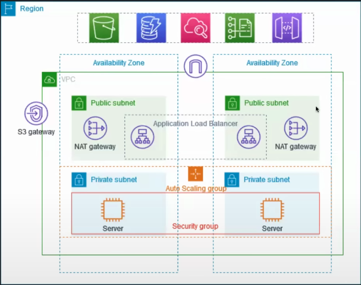

# About the project

This example demonstrates how to create a VPC that you can use for servuces in a production environment.



To imporve resiliency, you deploy the servers in two Availablility Zones, by using auto scaling group and an application load balancer. For additional security, you deploy the servers in private subnets. The servers recieve requests through the load balancer. The servers can connect to the internet by using a NAT gateway. To imporve resiliency, you deploy the NAT gateway in both Availability Zones.

### Overview

The VPC has public subnets and private subnets in two Availability Zones.

Each public subnet contains a NAT gateway and a load balancer node.

The servers run in the private subnets, are launched and terminated by using an Auto Sacling group, and receive traffic from the load balancer.

The Servers can connect to the internet by using the NAT gateway.

#### Before we start

- Auto Scaling Group
- Load Balancer
  - It balance the load to the server
- Target Group
- Bastion HOst or Junp Server

### Let's get started

**1. Create VPC with more**

- Give a aws-prod-example
- 10.0.0.0/16 is `enough`
- No ipv6
- No of AZ 2
- NAT gateway --> 1 per AZ
- VPC endpoint --> None

**Create Auto Scalling Group**

_create Launch template_

- Name --> same as vpc
- des --> proof of concept for app deploy in aws private subnet
- create security group
- select vpc
- inbound security group
- type -> ssh
- type -> custom TCp
- port -> 8000

_Now use template_

- Chose vpc
- All private subnet
- No load balancer
- Instance -> 2
- Desired Capacity -> 2

Check if the instance has created or not
since public ip is not available so we will create bastion host

- Create instance
- name -> bastion-host
- add security group
- edit network
- public subnet

_Go to terminal copy .pem file to private instance_

    scp -i ~/Downloads/privates/aws/aws_login.pem ~/Downloads/privates/aws/aws_login.pem ubuntu@13.61.194.3:/home/ubuntu

- Login to instance
  ssh -i ~/Downloads/privates/aws/aws_login.pem ubuntu@<publicip>

_Login to private instacne_

- copy the private ip address

  ssh -i .pem ubuntu@<privateip>

- Create simple html file
  vim index.html
- paste it
  ```

  ```
  save it `wq!`

run it:

    python3 -m http.server 8000

**Create Load balancer**

- Create loadbalancer
- name -> aws-pord-example
- internet facing
- select vpc
- pick up both subnet
- public subnet group

_create target group_

- select inatnce
- include pending group
- create target group
