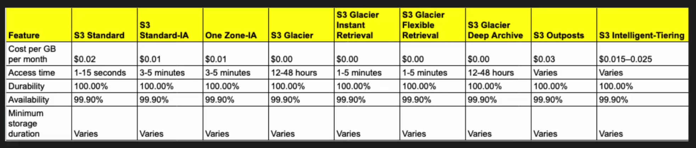

S3 service is simple to understand and exicute

It solves a very common problem of storage

- Globally accessable service
- Cost effective  
  s3 is a storage service (`Simple storage service`)

  

**What can you store in these S3?**
S3 service allows you to create buckets in which you can store anything.

_Start with Creating Bucket_

1. Create Bucket
2. S3 bucket name should be unique entire world
   `app1-payment-prod-example.com`
3. Create nearby region
4. upload file after bucket creation
   _Properties_
5. Enable Bucket Versioning
6. Add tags
   _permissions_
7. Create IAM user
8. Add permission
9. edit bucket polecy

   - add statement

```
{
	"Version": "2012-10-17",
	"Statement": [
		{
			"Sid": "BlockAllPrivateAccessExceptRoot",
			"Effect": "Deny",
			"Principal": "*",
			"Action": "s3:*",
			"Resource": [
				"arn:aws:s3:::app1.payment.prod.dev.com",
				"arn:aws:s3:::app1.payment.prod.dev.com/*"
			],
			"Condition": {
				"StringNotEquals": {
					"aws:PrincipalArn": "arn:aws:iam::876622473288:root"
				}
			}
		}
	]
}
```

`save it and try it with other user`

## How to host a static website

1. Go to bucket properties and edit it.
2. unblock public access
